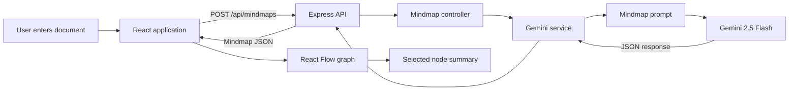

# Mini Mindmap

AI-powered document-to-mindmap generator built with React, TypeScript,
Express, and Google's Gemini API.

## Overview

Mini Mindmap accepts a document, asks Gemini to extract its main concepts and
relationships, and displays the result as an interactive node graph. Selecting
a node reveals its generated summary.

## Features

- Generate a structured mindmap from plain text.
- Use Gemini 2.5 Flash for summarization and relationship extraction.
- Explore nodes and connections with React Flow.
- Select a node to view its summary.
- Show loading, empty, and error states in the UI.
- Expose a small REST API for mindmap generation.

## Technology

| Layer | Technologies |
| --- | --- |
| Frontend | React 19, TypeScript, Vite, Axios, React Flow |
| Backend | Node.js, Express 5, TypeScript, Zod |
| AI | Google Gemini API, Gemini 2.5 Flash |

## Architecture



### Runtime flow

1. `App.tsx` stores the document, loading state, error state, generated mindmap, and selected node.
2. `services/api.ts` sends the document to `POST /api/mindmaps` using Axios.
3. Express routes the request to `createMindmap` in the controller.
4. The controller checks that `text` is present and calls `generateMindmap`.
5. The Gemini service rejects blank input, input shorter than 50 characters, and input longer than 15,000 characters.
6. Gemini receives the document and a JSON-only mindmap prompt.
7. The response is parsed and returned to the frontend.
8. `Mindmapdiagram.tsx` converts nodes and connections into React Flow elements.
9. Clicking a node updates the selection and `SummaryPanel.tsx` displays its summary.

## Project Structure

```text
.
├── Backend/
│   └── src/
│       ├── controllers/      HTTP request handlers
│       ├── models/           In-memory storage types
│       ├── prompts/          Gemini prompt builder
│       ├── routes/           Express route definitions
│       ├── services/         Gemini integration
│       ├── vaildators/        Zod schemas and inferred types
│       ├── app.ts            Express app and middleware
│       └── server.ts         HTTP server entry point
├── frontend/
│   └── src/
│       ├── components/       UI and graph components
│       ├── services/         Backend API client
│       ├── types/            Frontend mindmap types
│       ├── App.tsx           Main application state and layout
│       └── main.tsx          React entry point
└── README.md
```

## Setup

### Backend
# 🧠 Mini Mindmap

> AI-powered document-to-mindmap generator built with React, TypeScript, Express, and Google's Gemini API.

Mini Mindmap is a full-stack web application that transforms unstructured text into an interactive visual mindmap. Users can paste a document, generate a structured knowledge graph using AI, and explore each concept through an interactive node-based interface.

Developed as part of the **Visualli AI Engineering Challenge**.

---

## Preview


## Features

- Generate structured mind maps from plain text
- AI-powered summarization using Gemini
- Interactive node-link visualization
- Click any node to view its summary
- Responsive loading and error states
- Empty state for first-time users
- Backend schema validation using Zod
- Clean REST API architecture

---

## Tech Stack

## Frontend

- React
- TypeScript
- Vite
- React Flow
- Axios

## Backend

- Node.js
- Express
- TypeScript
- Google Gemini API
- Zod

---

## Architecture

```
                User Input
                     │
                     ▼
           React Frontend (Vite)
                     │
               REST API Request
                     │
                     ▼
            Express Backend API
                     │
              Gemini 2.5 Flash
                     │
          Structured JSON Response
                     │
          Zod Schema Validation
                     │
                     ▼
        Interactive React Flow Graph
```

---

## Project Structure

```
Mini-Mindmap
│
├── Backend
│   ├── controllers
│   ├── prompts
│   ├── routes
│   ├── services
│   ├── validators
│   ├── app.ts
│   └── server.ts
│
├── frontend
│   ├── components
│   ├── services
│   ├── types
│   ├── App.tsx
│   └── main.tsx
│
└── README.md
```

---

## Installation

## Clone

```bash
git clone https://github.com/yourusername/mini-mindmap.git
```

---

## Backend

```bash
cd Backend
npm install
```

Create `Backend/.env`:

```env
GEMINI_API_KEY=your_gemini_api_key
MOCK_MODE=false
PORT=3000
```

Start the API:
Create a `.env`

```env
GEMINI_API_KEY=YOUR_API_KEY
```

Run

```bash
npm run dev
```

The backend listens on `http://localhost:3000`.

### Frontend

In a second terminal:
Backend runs on

```
http://localhost:3000
```

---

## Frontend

```bash
cd frontend
npm install
npm run dev
```

Open `http://localhost:5173` in a browser.

Never commit a real API key. Keep `.env` local and private.

## API Reference

### `POST /api/mindmaps`

Generates a mindmap from document text. The equivalent route `POST /mindmaps`
is also registered by the backend.

Request:

```json
{
  "text": "A document with at least 50 characters of source material..."
}
```

Response (`200`):

```json
{
  "title": "Artificial Intelligence",
  "rootId": "root",
  "nodes": [
    {
      "id": "root",
      "label": "AI",
      "summary": "Artificial intelligence enables machines to perform intelligent tasks."
    }
  ],
  "connections": [
    {
      "from": "root",
      "to": "ml",
      "label": "includes"
    }
  ]
}
```

Expected data rules:

- `rootId` should match a node ID.
- Node IDs should be unique.
- Connections should reference existing node IDs.
- Each node contains `id`, `label`, and `summary`.
- Each connection contains `from`, `to`, and `label`.

Error responses:

| Status | Meaning | Body |
| --- | --- | --- |
| `400` | The request is missing `text` or violates the 50-15,000 character limit. | `{ "error": "Input is too short to generate a meaningful mindmap." }` |
| `500` | Gemini, JSON parsing, schema validation, or another server error failed. | `{ "error": "Failed to generate mindmap" }` |

## Current Limitations

- The backend validates the parsed Gemini response with `MindmapSchema` before returning it.
- Mindmaps are held only in frontend state; the in-memory store is not connected to persistence routes.
- The frontend and backend currently use different React Flow package versions/types, so the existing frontend build may require dependency/type alignment before deployment.
- The layout is a simple grid based on node order rather than an automatic graph layout.

## Future Improvements

- Align React Flow dependencies and shared connection types.
- Add automatic layout with Dagre or ELK.
- Persist and reload generated mindmaps.
- Add export, authentication, collaboration, and search features.
Frontend runs on

```
http://localhost:5173
```

---

## Design Decisions

This project was intentionally designed around a simple client-server architecture.

- React is responsible only for rendering and interaction.
- Express handles request validation and AI communication.
- Gemini generates the semantic structure.
- Zod validates every AI response before it reaches the frontend.
- React Flow renders the resulting graph while keeping the visualization interactive and lightweight.

This separation keeps the application modular, maintainable, and easy to extend.

---

## Error Handling

The application gracefully handles:

- Empty input
- Invalid requests
- Gemini API failures
- Invalid AI responses
- Schema validation failures
- Network errors

---

## Future Improvements

- Automatic graph layout using Dagre/ELK
- Mindmap persistence
- Export as PNG/PDF
- Authentication
- Collaborative editing
- Theme customization
- Search within mindmaps

---

## Learning Outcomes

Through this project, I gained practical experience with:

- Full-stack TypeScript development
- REST API design
- AI integration using Gemini
- Runtime schema validation
- Interactive graph visualization
- React component architecture
- Error handling patterns
- State management

---


This project was developed for the **Visualli AI Engineering Challenge**.

Feel free to fork, explore, and build upon it for learning purposes.
