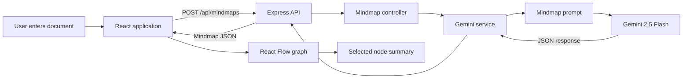

# Mini Mindmap

AI-powered document-to-mindmap generator built with React, TypeScript,
Express, and Google's Gemini API.

## Overview

Mini Mindmap accepts a document, asks Gemini to extract its main concepts and
relationships, and displays the result as an interactive node graph. Selecting
a node reveals its generated summary.

## Features

- Generate a structured mindmap from plain text.
- Use Gemini 2.5 Flash for summarization and relationship extraction.
- Explore nodes and connections with React Flow.
- Select a node to view its summary.
- Show loading, empty, and error states in the UI.
- Expose a small REST API for mindmap generation.

## Technology

| Layer | Technologies |
| --- | --- |
| Frontend | React 19, TypeScript, Vite, Axios, React Flow |
| Backend | Node.js, Express 5, TypeScript, Zod |
| AI | Google Gemini API, Gemini 2.5 Flash |

## Architecture



### Runtime flow

1. `App.tsx` stores the document, loading state, error state, generated mindmap, and selected node.
2. `services/api.ts` sends the document to `POST /api/mindmaps` using Axios.
3. Express routes the request to `createMindmap` in the controller.
4. The controller checks that `text` is present and calls `generateMindmap`.
5. The Gemini service rejects blank input, input shorter than 50 characters, and input longer than 15,000 characters.
6. Gemini receives the document and a JSON-only mindmap prompt.
7. The response is parsed and returned to the frontend.
8. `Mindmapdiagram.tsx` converts nodes and connections into React Flow elements.
9. Clicking a node updates the selection and `SummaryPanel.tsx` displays its summary.

## Project Structure

```text
.
├── Backend/
│   └── src/
│       ├── controllers/      HTTP request handlers
│       ├── models/           In-memory storage types
│       ├── prompts/          Gemini prompt builder
│       ├── routes/           Express route definitions
│       ├── services/         Gemini integration
│       ├── vaildators/        Zod schemas and inferred types
│       ├── app.ts            Express app and middleware
│       └── server.ts         HTTP server entry point
├── frontend/
│   └── src/
│       ├── components/       UI and graph components
│       ├── services/         Backend API client
│       ├── types/            Frontend mindmap types
│       ├── App.tsx           Main application state and layout
│       └── main.tsx          React entry point
└── README.md
```

## Setup

### Backend

```bash
cd Backend
npm install
```

Create `Backend/.env`:

```env
GEMINI_API_KEY=your_gemini_api_key
MOCK_MODE=false
PORT=3000
```

Start the API:

```bash
npm run dev
```

The backend listens on `http://localhost:3000`.

### Frontend

In a second terminal:

```bash
cd frontend
npm install
npm run dev
```

Open `http://localhost:5173` in a browser.

Never commit a real API key. Keep `.env` local and private.

## API Reference

### `POST /api/mindmaps`

Generates a mindmap from document text. The equivalent route `POST /mindmaps`
is also registered by the backend.

Request:

```json
{
  "text": "A document with at least 50 characters of source material..."
}
```

Response (`200`):

```json
{
  "title": "Artificial Intelligence",
  "rootId": "root",
  "nodes": [
    {
      "id": "root",
      "label": "AI",
      "summary": "Artificial intelligence enables machines to perform intelligent tasks."
    }
  ],
  "connections": [
    {
      "from": "root",
      "to": "ml",
      "label": "includes"
    }
  ]
}
```

Expected data rules:

- `rootId` should match a node ID.
- Node IDs should be unique.
- Connections should reference existing node IDs.
- Each node contains `id`, `label`, and `summary`.
- Each connection contains `from`, `to`, and `label`.

Error responses:

| Status | Meaning | Body |
| --- | --- | --- |
| `400` | The request is missing `text` or violates the 50-15,000 character limit. | `{ "error": "Input is too short to generate a meaningful mindmap." }` |
| `500` | Gemini, JSON parsing, schema validation, or another server error failed. | `{ "error": "Failed to generate mindmap" }` |

## Current Limitations

- The backend validates the parsed Gemini response with `MindmapSchema` before returning it.
- Mindmaps are held only in frontend state; the in-memory store is not connected to persistence routes.
- The frontend and backend currently use different React Flow package versions/types, so the existing frontend build may require dependency/type alignment before deployment.
- The layout is a simple grid based on node order rather than an automatic graph layout.

## Future Improvements

- Align React Flow dependencies and shared connection types.
- Add automatic layout with Dagre or ELK.
- Persist and reload generated mindmaps.
- Add export, authentication, collaboration, and search features.
